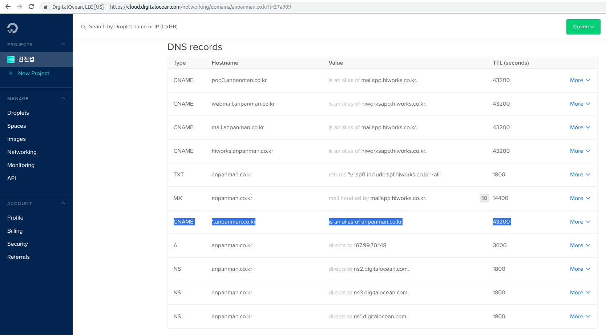
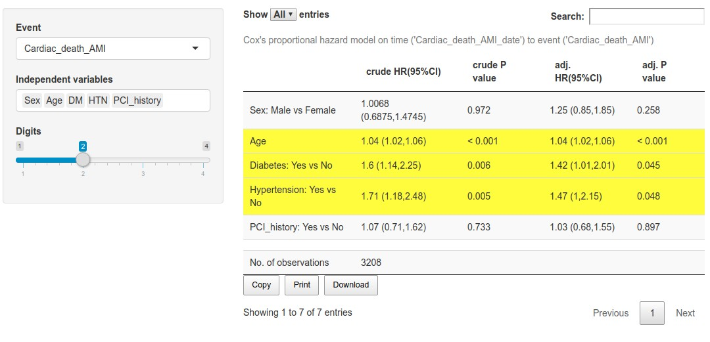
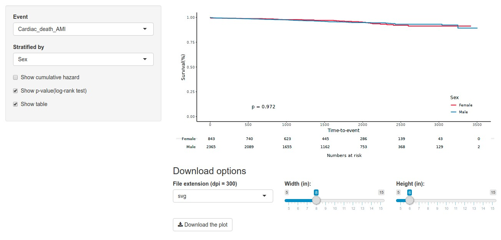

```{r setup, include=FALSE}
knitr::opts_chunk$set(echo = FALSE, fig.align = "center")
library(knitr);library(DT);library(dplyr)
```


# Executive Summary 


맞춤형 의학연구 애플리케이션을 위해


1. `Rstudio`와 `shiny server`가 설치된 [Docker](https://www.docker.com/what-docker) 이미지를 만들고 이것을 [Docker swarm](https://docs.docker.com/engine/swarm/)을 이용해 배포함으로써 서버의 종류와 갯수에 구애받지 않는  **마이크로서비스 아키텍처**(microservice architecture)를 구축하였으며


2. 동적 프록시 서버(dynamic proxy server) 프로그램인 [Traefik](https://traefik.io/) 을 이용하여  서비스가 추가될 때 마다(ex: 홈페이지, Jupyter) 이에 맞추어 **https** 보안이 적용된 **subdomain 주소**를 부여하였습니다.


3. 흔히 이용되는 의학통계 방법들을 `ShinyApps` 로 만들어 위의 환경에 배포하였으며, 모든 앱에는 논문/보고서용 테이블과 그림을 위해 **데이터 라벨(label) 정보**를 적용하였습니다.


# 1. 마이크로서비스 아키텍처 

# 

```{r, out.width= "40%"}
include_graphics("https://blog.philipphauer.de/blog/2015/0411-microservices-nutshell-pros-cons/Monolith-vs-Microservices.png")
```

```{r, out.width= "60%"}
include_graphics("https://blog.philipphauer.de/blog/2015/0411-microservices-nutshell-pros-cons/Scaling-Microservices.png")
```

https://blog.philipphauer.de/microservices-nutshell-pros-cons/


# 여행용 파우치 

```{r,  out.width= "60%"}
include_graphics("https://funshop.akamaized.net/products/0000045775/HF-INLUGGAGE-POUCH-LINGERIE-%EC%83%81%EC%84%B8%ED%8E%98%EC%9D%B4%EC%A7%80_01.jpg")
```

https://funshop.akamaized.net/products/0000045775/HF-INLUGGAGE-POUCH-LINGERIE-%EC%83%81%EC%84%B8%ED%8E%98%EC%9D%B4%EC%A7%80_01.jpg


# 여행용 파우치 장단점

장점

1. 깔끔하다.

2. 치우기 쉽다. 

3. 다른 가방으로 옮기기 쉽다. 

4. 가방 종류에 구애받지 않는다.


단점

1. 실제 쓸 수 있는 공간이 줄어든다. 

2. 분리해서 넣기 귀찮다. 

3. 물건 찾을 때 지퍼를 한번 더 열어야 된다. 


# Microservice 장단점

장점

1. 깔끔하다.

2. 삭제가 쉽다. 

3. 다른 컴퓨터에 재설치 쉽다.

4. 컴퓨터/서버 종류에 구애받지 않는다. 


단점

1. 실제 쓸 수 있는 용량이 줄어든다. 

2. 서비스마다 모듈 만들기 귀찮다. 

3. 성능저하 우려 


**가상머신(Virtual machine)** 활용이 대표적.  


# [Docker](https://www.docker.com/what-docker)

- 빠르고 용량이 적은 가상머신?
- [Docker hub](https://hub.docker.com/)을 통해 [github](https://github.com/)처럼 이용가능.  
- 서버에 rstudio 설치(X), 서버에  rstudio가 설치된 리눅스 이미지를 설치(O). 

```{r, out.width= "50%", fig.cap = "VM vs Docker"}
include_graphics("https://subicura.com/assets/article_images/2017-01-19-docker-guide-for-beginners-1/vm-vs-docker.png")
```

https://subicura.com/2017/01/19/docker-guide-for-beginners-1.html

# [Docker hub](https://hub.docker.com/) 활용 예

- [rshiny docker image](https://hub.docker.com/r/jinseob2kim/docker-rshiny/)


- [rshiny github](https://github.com/jinseob2kim/docker-rshiny)


```shell
docker run --rm -d -p 3838:3838 -p 8787:8787 \
    -e USER=js -e PASSWORD=js -e ROOT=TRUE\
    jinseob2kim/docker-rshiny
```

- **--rm -d** : 실행 중지시 지움(--rm), 백그라운드 실행(-d)
- 호스트의 **3838**포트를 이미지의 **3838**포트(`shiny server`)와 연결,  **8787**포트를 **8787**포트(`rstudio server`)에 연결
- 유저 생성 : **js/js, 루트 권한**
- [Docker hub](https://hub.docker.com/) 주소 : **jinseob2kim/docker-rshiny**


# 서버의 갯수?

1. `Rstudio`와 `shiny server`가 설치된 [Docker](https://www.docker.com/what-docker) 이미지를 만들고 이것을 [Docker swarm](https://docs.docker.com/engine/swarm/)을 이용해 배포함으로써 서버의 **종류와 갯수**에 구애받지 않는  **마이크로서비스 아키텍처**(microservice architecture)를 구축하였으며


서버의 **갯수에 구애받지 않는다?** [Docker](https://www.docker.com/what-docker) 만으로는 불가능. 


# [Docker swarm](https://docs.docker.com/engine/swarm/) 

- Server orchestration: 지휘자가 오케스트라 연주하듯이
- 여러대의 서버를 묶어 마치 하나의 서버를 이용하는 것처럼 느낌. 
- [Docker](https://www.docker.com/what-docker) 이미지를 실행하면 자동으로 한가한 서버에 배치. 
- [Docker](https://www.docker.com/what-docker) 에 내장되어 별다른 설치 필요없음. 
- 비슷한 프로그램으로 구글의 [Kubernetes](https://kubernetes.io/) 가 있음. 


```{r, out.width= "50%"}
include_graphics("https://www.upcloud.com/support/wp-content/uploads/2016/10/Docker-Swarm-Orchestration-1024x265.png")
```

https://www.upcloud.com/support/docker-swarm-orchestration/


#

```{r, out.width= "70%", fig.cap = "Docker vs Docker swarm"}
include_graphics("https://www.penflip.com/akira.ohio/appcatalyst-hands-on-lab-en/blob/master/images/docker-ppt-swarm-1.png/?raw=true")
```

https://www.penflip.com/akira.ohio/appcatalyst-hands-on-lab-en/blob/master/images/docker-ppt-swarm-1.png/?raw=true


# Manager & worker node

```{r, out.width= "50%", fig.cap = "실행 상태"}
include_graphics("https://pbs.twimg.com/media/DP5VZC8UIAAnV6j.jpg:large")
```

https://pbs.twimg.com/media/DP5VZC8UIAAnV6j.jpg:large


# 예: [Docker swarm](https://docs.docker.com/engine/swarm/) 으로 서버들을 하나로 묶기


```shell
manger_ip = $(123.456.789.10)

# Init Docker Swarm mode: In manager node
docker swarm init --advertise-addr $manager_ip


# Get Swarm tokens
worker_token=$(docker swarm join-token worker -q)


# Join worker nodes: In worker node
docker swarm join --token $worker_token $manager_ip:2377

````

https://www.youtube.com/watch?v=2RQbpnRxx-Y


# 주의

연결 가능한 서버끼리만 묶을 수 있다. 

1. AWS끼리(O), Azure끼리(O), Digitalocean끼리(O)

2. **AWS와 Azure(X), AWS와 Digitalocean(X)**

3. **AWS(Azure, Digitalocean)와 자체서버(X)**


# 서비스 실행: rstudio & shiny server

자체적으로 이미지 [docker-rshiny](https://hub.docker.com/r/jinseob2kim/docker-rshiny/) 를 만들어 사용하였다.

```shell
docker service create \
    --name rshiny \
    --publish 8787:8787 \
    --publish 3838:3838 \ 
    -e USER=js -e PASSWORD=js -e ROOT=TRUE \
     jinseob2kim/docker-rshiny
```

Manger node와 worker node 주소 모두에서 **8787** 포트로 `rstudio server`를, **3838** 포트로 `shiny server`를 실행할 수 있다. 

- Worker node에 [docker-rshiny](https://hub.docker.com/r/jinseob2kim/docker-rshiny/) 가 설치되었더라도 manager node에서 실행할 수 있다. 


추가: [tensorflow docker](https://hub.docker.com/r/tensorflow/tensorflow/) 실행 

```shell
docker service create \
    --name tf \
    --publish 8888:8888\
     tensorflow/tensorflow
```

# 

```{r, out.width= "50%", fig.cap = "어떤 ip로 접속해도 실행 가능"}
include_graphics("http://callistaenterprise.se/assets/blogg/docker/docker-in-swarm-mode-on-docker-in-docker/docker-swarm.png")
```

http://callistaenterprise.se/assets/blogg/docker/docker-in-swarm-mode-on-docker-in-docker/docker-swarm.png


# 사용자가 늘어나면?

`docker service scale` 명령어 이용 

```shell
docker service scale rshiny=2
```

다시 줄이기 

```shell
docker service scale rshiny=1
```


# 옵션: [Docker-machine](https://docs.docker.com/machine/overview/)

- 여러 대의 서버(docker가 설치된)를 로컬 컴퓨터에서 한 번에 관리할 수 있음. 
- 클라우드 지원: 예) AWS 서버 2대 불러오기, 서버 삭제하기

```{r, out.width= "70%"}
include_graphics("https://docs.docker.com/machine/img/machine-mac-win.png")
include_graphics("https://docs.docker.com/machine/img/provision-use-case.png")
```

https://docs.docker.com/machine/overview/#whats-the-difference-between-docker-engine-and-docker-machine


# [Docker-machine](https://docs.docker.com/machine/overview/) 설치

```shell
base=https://github.com/docker/machine/releases/download/v0.15.0 &&
curl -L $base/docker-machine-$(uname -s)-$(uname -m) >/tmp/docker-machine &&
sudo install /tmp/docker-machine /usr/local/bin/docker-machine
docker-machine version
```

# 예: Digital ocean - manager 이름으로 서버 생성.   

```shell
export DIGITALOCEAN_ACCESS_TOKEN=<YOUR_DIGITALOCEAN_ACCESS_TOKEN>
export DIGITALOCEAN_IMAGE="ubuntu-18-04-x64"
export DIGITALOCEAN_REGION="sgp1"
echo "### Creating manager nodes ..."

for c in {1..1} ; do
  docker-machine create \
     --driver digitalocean \
     --digitalocean-access-token $DIGITALOCEAN_ACCESS_TOKEN \
     --digitalocean-image $DIGITALOCEAN_IMAGE \
     --digitalocean-region $DIGITALOCEAN_REGION \
     --digitalocean-size "s-2vcpu-4gb" \
     manager$c &&\
  docker-machine ssh manager$c "adduser js --gecos 'First Last,RoomNumber,WorkPhone,HomePhone' --disabled-password && sh -c 'echo js:js | sudo chpasswd' && usermod -aG sudo js"
done
```


# AWS

```shell
export AWS_ACCESS_KEY_ID=<YOUR_AWS_ACEESS_KEY_ID>
export AWS_SECRET_ACCESS_KEY=<YOUR_AWS_SECRET_ACCESS_KEY>
export AWS_INSTANCE_TYPE="t2.micro" 
export AWS_INSTANCE_REGION="ap-northeast-2"
export AWS_SECURITY_GROUP="launch-wizard-2"
export AWS_VPC_ID=<YOUR_AWS_VPC_ID>
export AWS_ZONE=c


for c in {1..1} ; do
docker-machine create \
  --driver amazonec2 \
  --amazonec2-access-key $AWS_ACCESS_KEY_ID \
  --amazonec2-secret-key $AWS_SECRET_ACCESS_KEY \
  --amazonec2-region $AWS_INSTANCE_REGION \
  --amazonec2-vpc-id $AWS_VPC_ID \
  --amazonec2-open-port 3838 \
  --amazonec2-open-port 8787 \
  --amazonec2-open-port 8000 \
  --amazonec2-open-port 8080 \
  --amazonec2-open-port 2377 \
  --amazonec2-open-port 7946 \
  --amazonec2-open-port 7946/udp \
  --amazonec2-open-port 4789 \
  --amazonec2-open-port 4789/udp \
  --amazonec2-open-port 8888 \
  --amazonec2-open-port 80 \
  --amazonec2-open-port 443 \
  manager$c && \
  docker-machine ssh manager$c "adduser js --gecos 'First Last,RoomNumber,WorkPhone,HomePhone' --disabled-password && sh -c 'echo js:js | sudo chpasswd' && usermod -aG sudo js"
done
```

# AZURE

```shell
export sub=<YOUR_AZURE_SUBSCRIPTION_VALUE>

for c in {1..1} ; do
docker-machine create \
    --driver azure \
    --azure-location "koreacentral" \
    --azure-size Standard_B1s \
    --azure-subscription-id $sub \
    --azure-open-port 3838 \
    --azure-open-port 8787 \
    --azure-open-port 8000 \
    --azure-open-port 8080 \
    --azure-open-port 2377 \
    --azure-open-port 7946 \
    --azure-open-port 7946/udp \
    --azure-open-port 4789 \
    --azure-open-port 4789/udp \
    --azure-open-port 8888 \
    --azure-open-port 80 \
    --azure-open-port 443 \
    manager$c && \
    docker-machine ssh manager$c "adduser js --gecos 'First Last,RoomNumber,WorkPhone,HomePhone' --disabled-password && sh -c 'echo js:js | sudo chpasswd' && usermod -aG sudo js"
done
```


# 묶을 서버 추가오기 : Worker node 

```shell
export DIGITALOCEAN_SIZE="s-1vcpu-1gb"
echo "### Creating worker nodes ..."
for c in {1..1} ; do
    docker-machine create \
  --driver digitalocean \
  --digitalocean-access-token $DIGITALOCEAN_ACCESS_TOKEN \
  --digitalocean-image $DIGITALOCEAN_IMAGE \
  --digitalocean-region $DIGITALOCEAN_REGION \
  --digitalocean-size $DIGITALOCEAN_SIZE \
  worker$c && \
  docker-machine ssh worker$c "adduser js --gecos 'First Last,RoomNumber,WorkPhone,HomePhone' --disabled-password && sh -c 'echo js:js | sudo chpasswd' && usermod -aG sudo js"
done
```


# 서버 묶기 : [Docker-machine](https://docs.docker.com/machine/overview/) 활용 

**manager1** 과 **worker1** 노드를 [docker swarm](https://docs.docker.com/engine/swarm/)를 활용하여 묶자. 

```shell
# Get IP from leader node
leader_ip=$(docker-machine ip manager1)

# Init Docker Swarm mode
echo "### Initializing Swarm mode ..."
eval $(docker-machine env manager1)
docker swarm init --advertise-addr $leader_ip

# Swarm tokens
manager_token=$(docker swarm join-token manager -q)
worker_token=$(docker swarm join-token worker -q)

# Joinig manager nodes
echo "### Joining manager modes ..."
for c in {1..1} ; do
    eval $(docker-machine env manager$c)
    docker swarm join --token $manager_token $leader_ip:2377
done

# Join worker nodes
echo "### Joining worker modes ..."
for c in {1..1} ; do
    eval $(docker-machine env worker$c)
    docker swarm join --token $worker_token $leader_ip:2377
done


# Clean Docker client environment
echo "### Cleaning Docker client environment ..."
eval $(docker-machine env -u)
```


# 2. Dynamic proxy & https: [Traefik](https://traefik.io/)


# Problem

- DOMAINNAME:3838, :8787 보여주기 싫다. `/server`, `/app` 으로는 안되나?


**리버스 프록시(reverse proxy)** 프로그램이 필요하다. 

- [nginx](https://nginx.org/en/) 가 대표적.

```{r, out.width= "40%"}
include_graphics("https://diarmuid.ie/media/nginx-docker-reverse-proxy.png")
```

https://diarmuid.ie/media/nginx-docker-reverse-proxy.png


# Problem: [nginx](https://nginx.org/en/)

1. [Docker](https://www.docker.com/what-docker) 와 궁합이 안좋다. 

- 서비스 실행해서 포트 추가될 때마다 일일히 주소 적용해줘야됨. 

- [Docker swarm](https://docs.docker.com/engine/swarm/) 과는 더 안좋다. 


2. `https` 적용 불가능 

- 따로 비용을 지불하거나 

- 무료 `https` 적용 프로그램인 [Let's Encrypt](https://letsencrypt.org/) 를 수동으로 적용해야됨. 


[`HTTP` 구글 크롬서 퇴출 수순…7월부터 "안전하지 않다" 경고](http://news.mk.co.kr/newsRead.php?sc=30000037&year=2018&no=129224)


# [Traefik](https://traefik.io/)

[Docker swarm](https://docs.docker.com/engine/swarm/) 을 위한 **dynamic proxy** 프로그램

- `rstudio server` 서비스 추가하면 **rstudio.DOMAINNAME** 로 자동으로 **subdomain** 적용. `tensorflow` 서비스 추가하면 **tensorflow.DOMAINNAME** 으로 적용. 

- `https` 자동 적용됨: [Let's Encrypt](https://letsencrypt.org/) 연계 

```{r, out.width= "70%"}
include_graphics("https://ian-says.com/articles/traefik-proxy-docker-ssl/thumbnail.png")
```

https://ian-says.com/articles/traefik-proxy-docker-lets-encrypt/


# Overview [Traefik](https://traefik.io/) 

```{r, out.width= "90%"}
include_graphics("https://i2.wp.com/codersdiary.me/wp-content/uploads/2017/03/drawit-diagram-7.png?w=1382&ssl=1")
```

https://codersdiary.me/en/2017/04/01/reverse-proxy-and-docker-containers/


# Run [Traefik](https://traefik.io/)

1. 도메인 추가: *.DOMAINNAME

도메인 설정 **CNAME**에 ** *.DOMAINNAME**를 추가해야 된다. 

```{r, out.width= "70%"}

```


#
2. [Traefik](https://traefik.io/) 용 network 만들기

```shell
eval $(docker-machine env manager1)
DOMAINNAME="anpanman.co.kr"

# Create network for swarm
docker network create --driver=overlay traefik-net
```


# 

3. [Let's Encrypt](https://letsencrypt.org/) 설정

- 빈 **acme.json** 파일을 만든다 (읽기쓰기 가능).

- 세부 설정이 담긴 **traefik.toml** 을 만든다.

```shell
# For Let's Encrypt
docker-machine ssh manager1 "DOMAINNAME=anpanman.co.kr && \ 
                             mkdir /home/js/opt && \ 
                             mkdir /home/js/opt/traefik && \
                             cd /home/js/opt/traefik && \
                             touch acme.json && chmod 600 acme.json && \
                             wget -O traefik.toml  https://raw.githubusercontent.com/jinseob2kim/swarm-setting/master/opt/traefik/traefik.toml"
```                             


#

4. Run [Traefik](https://traefik.io/)

```shell
# Create traefik service
docker service create \
    --name traefik \
    --constraint=node.role==manager \
    --publish 80:80 --publish 443:443\
    --mount type=bind,source=/var/run/docker.sock,target=/var/run/docker.sock \
    --mount type=bind,source=/root/acme.json,target=/acme.json \
    --mount type=bind,source=/root/traefik.toml,target=/traefik.toml \
    -e DO_AUTH_TOKEN=$DIGITALOCEAN_ACCESS_TOKEN \
    -l traefik.port=8080 \
    -l traefik.frontend.rule=Host:monitor.$DOMAINNAME\
    --network traefik-net \
    traefik \
    --logLevel=INFO \
    --docker \
    --docker.swarmMode \
    --docker.watch \
    --docker.domain=$DOMAINNAME
```

https://monitor.anpanman.co.kr 에서 dashboard를 볼 수 있다.


# 서비스 재실행: rstudio & shiny server

[Traefik](https://traefik.io/) 를 적용하여 재실행하자. 

```shell
docker service create \
    --name rshiny \
    --label traefik.shiny.port=3838 \
    --label traefik.rstudio.port=8787 \
    --label traefik.shiny.frontend.rule="Host:app.anpanman.co.kr" \
    --label traefik.rstudio.frontend.rule="Host:server.anpanman.co.kr" \
    -e USER=js -e PASSWORD=js -e ROOT=TRUE \
    --network traefik-net \
     jinseob2kim/docker-rshiny
```
https://server.anpanman.co.kr 에서 'rstudio server'를, https://app.anpanman.co.kr 에서 'shiny server'를 실행할 수 있다. 


# 서비스 추가: 홈페이지

proxy server 프로그램인 [nginx](https://www.nginx.com/)의 [docker image](https://hub.docker.com/_/nginx/) 를 이용하였고, [blogdown 패키지](https://github.com/rstudio/blogdown) 를 활용해서 홈페이지를 만들었다. 


```shell
docker service create \
    --name nginx \
    --label traefik.port=80 \
    --label traefik.frontend.rule="Host:${DOMAINNAME},www.${DOMAINNAME}" 
    --network traefik-net \
    nginx 
```
https://anpanman.co.kr, https://www.anpanman.co.kr 에서 [nginx](https://www.nginx.com/) 실행환경을 볼 수 있다. 


# 중간 정리 

1. 필요한 서비스를 미리 [Docker image](https://hub.docker.com/r/jinseob2kim/docker-rshiny/) 로 만들었다. 

2. [Docker-machine](https://docs.docker.com/machine/overview/) 을 이용하여 [Docker](https://www.docker.com/what-docker)가 설치된 클라우드 서버를 여러 개 생성한 후 

3. [Docker swarm](https://docs.docker.com/engine/swarm/) 을 통해 서버들을 묶었다. 

4. 이제 서비스를 실행하면 Swarm 환경이 알아서 적절한 서버를 골라 실행한다. 

5. [Traefik](https://traefik.io/) 을 이용하여 서비스를 추가할 때마다 그에 맞는 **subdomain** 주소를 자동으로 할당하였다. 

6. [Let's Encrypt](https://letsencrypt.org/) 을 통한 **https** 인증이 자동으로 적용된다. 


# 3. 의학연구용 `ShinyApps` 만들기 

# 주 활용 패키지 

- 데이터: `data.table`, `DT`

- 통계분석: `tableone`, `epiDisplay`, `survival`, `geepack`, `lme4`, `plotROC`, `pROC`

- Plot: `ggplot2`, `GGally`, `svglite`

- 패키지: `devtools`, `roxygen2`

- Shiny: `shinycustomloader`, `shiny.i18n` 


# [`DT`](https://rstudio.github.io/DT/)

- 반응형 테이블 패키지

- 셀 강조 (ex: **색깔**) : `formatStyle` 옵션 

- 엑셀 파일로 바로 **다운로드** : `Buttons` 옵션

```{r}
datatable(iris, extension= "Buttons",
          options = list(dom = '<lf<rt>Bip>', lengthMenu = list(c(10, 25, -1), c('10', '25', 'All')), pageLength = 10,
                        buttons = list('copy', 'print', 
                                       list(extend = 'collection', 
                                            buttons = list(list(extend = 'csv', filename= "table"),
                                                           list(extend = 'excel', filename= "table"), 
                                                           list(extend = 'pdf', filename= "table")
                                                           ), 
                                            text = 'Download')
                                       )
                        )
          ) %>% 
  formatStyle('Sepal.Length', fontWeight = styleInterval(5, c('normal', 'bold'))) %>%
  formatStyle(
    'Sepal.Width',
    color = styleInterval(c(3.4, 3.8), c('white', 'blue', 'red')),
    backgroundColor = styleInterval(3.4, c('gray', 'yellow'))
  ) %>%
  formatStyle(
    'Petal.Length',
    background = styleColorBar(iris$Petal.Length, 'steelblue'),
    backgroundSize = '100% 90%',
    backgroundRepeat = 'no-repeat',
    backgroundPosition = 'center'
  ) %>%
  formatStyle(
    'Species',
    transform = 'rotateX(45deg) rotateY(20deg) rotateZ(30deg)',
    backgroundColor = styleEqual(
      unique(iris$Species), c('lightblue', 'lightgreen', 'lightpink')
    )
  )

```


#

```{r, echo = T,  eval = F}
datatable(iris, extension= "Buttons",
          options = list(dom = '<lf<rt>Bip>', lengthMenu = list(c(10, 25, -1), c('10', '25', 'All')), pageLength = 10,
                        buttons = list('copy', 'print', 
                                       list(extend = 'collection', 
                                            buttons = list(list(extend = 'csv', filename= "table"),
                                                           list(extend = 'excel', filename= "table"), 
                                                           list(extend = 'pdf', filename= "table")
                                                           ), 
                                            text = 'Download')
                                       )
                        )
          ) %>% 
  formatStyle('Sepal.Length', fontWeight = styleInterval(5, c('normal', 'bold'))) %>%
  formatStyle(
    'Sepal.Width',
    color = styleInterval(c(3.4, 3.8), c('white', 'blue', 'red')),
    backgroundColor = styleInterval(3.4, c('gray', 'yellow'))
  ) %>%
  formatStyle(
    'Petal.Length',
    background = styleColorBar(iris$Petal.Length, 'steelblue'),
    backgroundSize = '100% 90%',
    backgroundRepeat = 'no-repeat',
    backgroundPosition = 'center'
  ) %>%
  formatStyle(
    'Species',
    transform = 'rotateX(45deg) rotateY(20deg) rotateZ(30deg)',
    backgroundColor = styleEqual(
      unique(iris$Species), c('lightblue', 'lightgreen', 'lightpink')
    )
  )

```


# [`shinycustomloader`](https://github.com/emitanaka/shinycustomloader)

- 앱 실행 중 로딩 보여주기.

- 실행이 오래걸리는 앱일 때 필요.

```{r, out.width= "70%"}
include_graphics("https://user-images.githubusercontent.com/7620319/38162696-cafcd18e-3531-11e8-8228-f08defa97ae0.gif")
```


# Label

- **데이터**의 변수명, 값 $\neq$ **테이블/그림**의 변수명, 값 

- **Label data** 생성하고 통계결과와 그림에 적용: [자체 패키지](https://github.com/jinseob2kim/jstable)

```{r, out.width= "70%"}
include_graphics("label.jpg")
```


# Table 1: `tableone` package

```{r, out.width= "70%"}
include_graphics("https://github.com/kaz-yos/tableone/raw/master/tableone.gif")
```

https://github.com/kaz-yos/tableone

- [`table one`](https://github.com/kaz-yos/tableone) 패키지 기반으로 **Label** 정보 적용하여 앱 구현


# Main results 

- **Regression, logistic regression, cox** : `epiDisplay` 패키지 기반으로 결과테이블 생성

- **GEE, linear mixed model, GLMM** : [자체 패키지](https://github.com/jinseob2kim/jstable) 로 결과테이블 생성

- **Label** 정보 적용.

```{r, out.width= "60%"}

```


# Plot

- `GGally` : `ggpair` 함수로 변수 비교

- `svglite`: **svg** 포맷으로 그림 저장하여 **ppt**에서 수정 가능. 

- Kaplan meire plot: [`ggkm` 패키지](https://github.com/michaelway/ggkm) 기반으로 [자체 패키지](https://github.com/jinseob2kim/jskm) 사용 

```{r, out.width= "70%"}

```


# 다중언어 지원 

- [`shiny.i18n` 패키지](https://github.com/Appsilon/shiny.i18n)

```{r, out.width= "70%"}
include_graphics("https://cdn-ak.f.st-hatena.com/images/fotolife/k/ksmzn/20171209/20171209204102.gif")
```

https://cdn-ak.f.st-hatena.com/images/fotolife/k/ksmzn/20171209/20171209204102.gif


# Examples 

1. [기본 앱 모음](https://app.anpanman.co.kr/navbar)

2. [건강설문조사 리포트](https://app.anpanman.co.kr/health-report)

3. [대장암 환자 연구: 강릉아산병원](https://app.anpanman.co.kr/yschoi)

4. [이완기 압력 계산: 삼성서울병원](https://app.anpanman.co.kr/chkh/dPR)

5. [다중 언어: 한/영](https://app.anpanman.co.kr/shiny.i18n)

# Q & A {.bigger}


